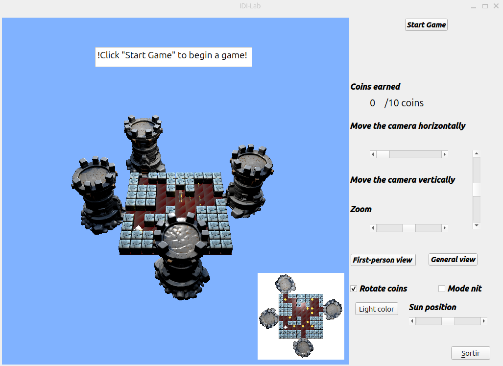
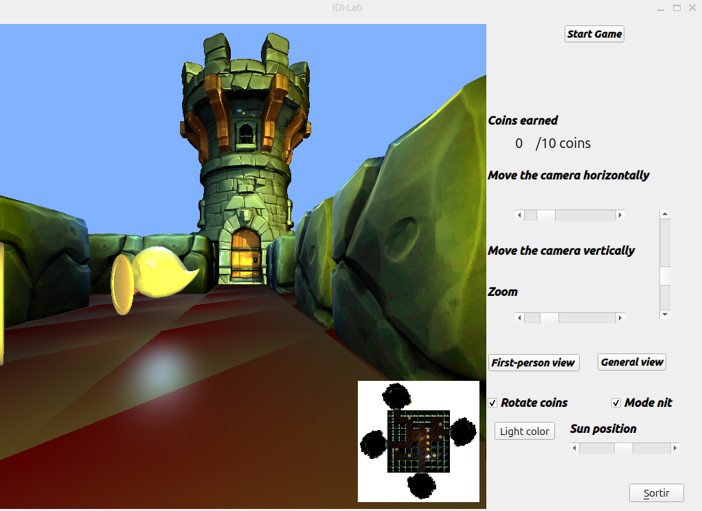
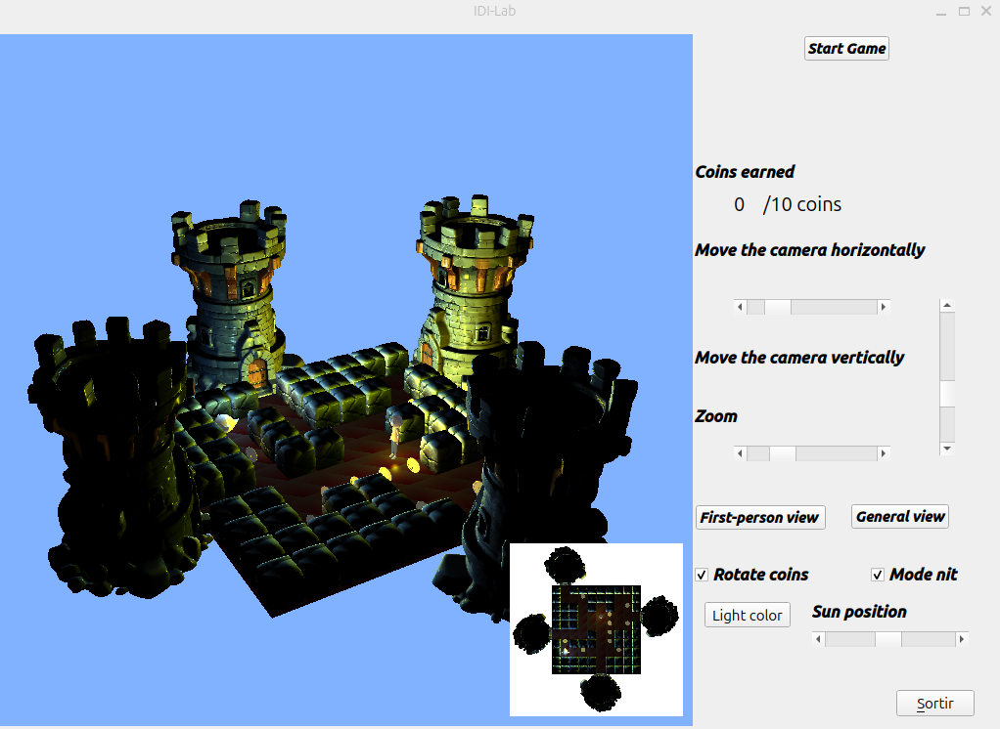
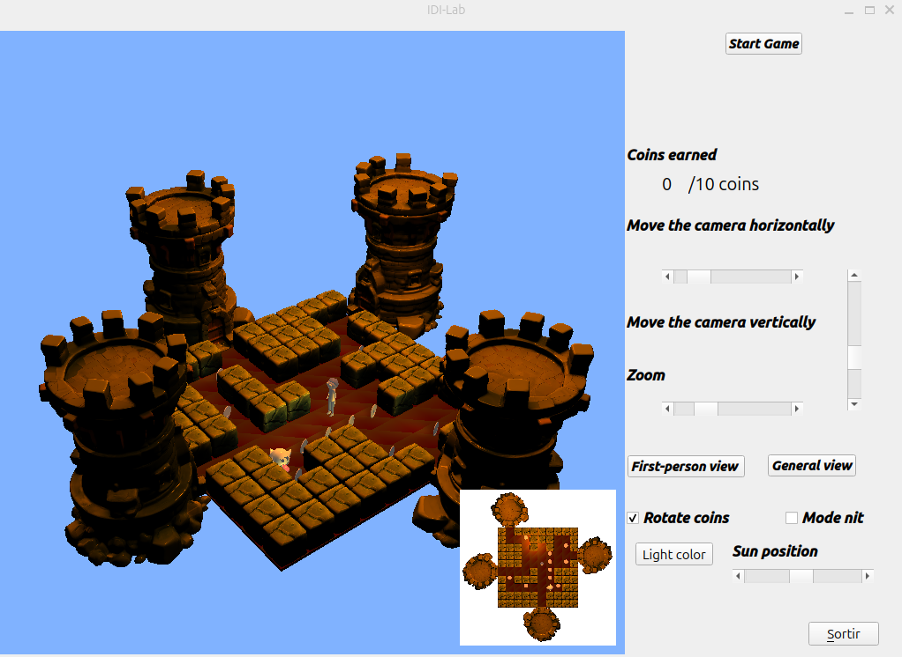

# Ghost in the Maze

**Videojuego 3D de un laberinto desarrollado con Qt y OpenGL** 

## Descripción del proyecto

Ghost in the Maze es un videojuego en 3D en el que el jugador debe recorrer un laberinto, recoger 10 monedas y llegar a la salida sin que lo atrape el fantasma.

El proyecto se centra en los gráficos 3D, los sistemas de cámara, las transformaciones geométricas, la iluminación y la interacción con el usuario.

## Funcionalidades

* **Laberinto 3D:** generación de la escena a partir de una matriz que representa las paredes y las zonas transitables.
* **Movimiento del jugador:** desplazamiento por el laberinto evitando obstáculos.
* **Comportamiento del enemigo:** movimiento automático del fantasma por el laberinto.
* **Recogida de monedas:** recolección de monedas distribuidas por el escenario.
* **Diferentes cámaras:** vista general en perspectiva, vista en primera persona y minimapa con vista aérea.
* **Controles interactivos de cámara:** rotación de la escena y control del zoom.
* **Gráficos 3D:** uso de modelos, texturas y transformaciones geométricas.
* **Shaders e iluminación:** iluminación ambiental, focos de luz y shaders de vértices y fragmentos.
* **Modo nocturno:** iluminación alternativa y linterna para el personaje.
* **Interfaz gráfica:** inicio y reinicio de la partida, contador de monedas y mensajes de victoria o fin de partida.

## Tecnologías utilizadas

* **Qt:** interfaz gráfica e interacción con el usuario.
* **OpenGL:** renderizado y gestión de la escena 3D.
* **GLSL:** programación de shaders y efectos de iluminación.
* **Assimp:** carga de modelos 3D.
* **C++:**
  
## Cómo jugar

### Objetivo

Recoge las 10 monedas repartidas por el laberinto y llega a la salida sin que te atrape el fantasma.

### Controles

| Tecla / acción      | Función                                                                      |
| ------------------- | ---------------------------------------------------------------------------- |
| ⬆️ Flecha arriba    | Avanzar hacia delante                                                        |
| ⬅️ Flecha izquierda | Girar 90° hacia la izquierda                                                 |
| ➡️ Flecha derecha   | Girar 90° hacia la derecha                                                   |
| `C`                 | Alternar entre las vistas de cámara disponibles mediante esta tecla          |
| `+` / `-`           | Acercar o alejar la cámara                                                   |
| Ratón               | Rotar la vista general                                                       |
| `N`                 | Activar o desactivar el modo nocturno                                        |

### Desarrollo de la partida

1. Pulsa **Start Game** en la interfaz para iniciar la partida.
2. Muévete por el laberinto usando las flechas del teclado.
3. Recoge las monedas mientras evitas al fantasma.
4. Consigue las 10 monedas y llega a una salida para ganar.
5. Si el fantasma te atrapa, la partida termina.
6. Pulsa **Start Game** de nuevo para reiniciar la partida.

### Cámaras e iluminación

El juego incluye distintas opciones de visualización, como la vista general del laberinto, la vista en primera persona y una vista aérea en miniatura. También permite modificar la cámara y experimentar con la iluminación y el modo nocturno desde los controles disponibles en la interfaz.

## Capturas del juego

### Vista inicial del juego

### Vista en primera persona

### Modo nocturno

### Cambio del color de la iluminación

